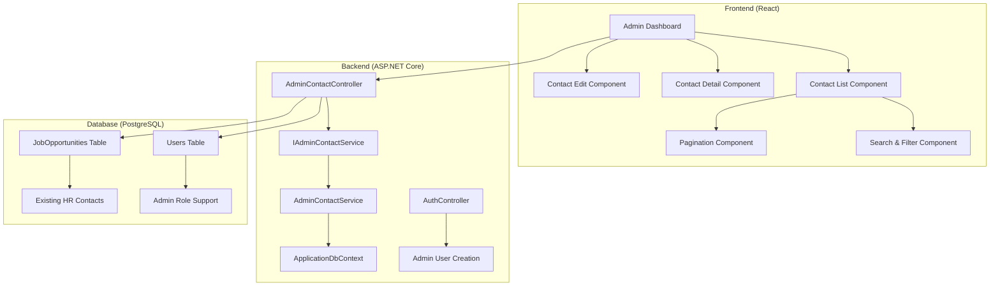
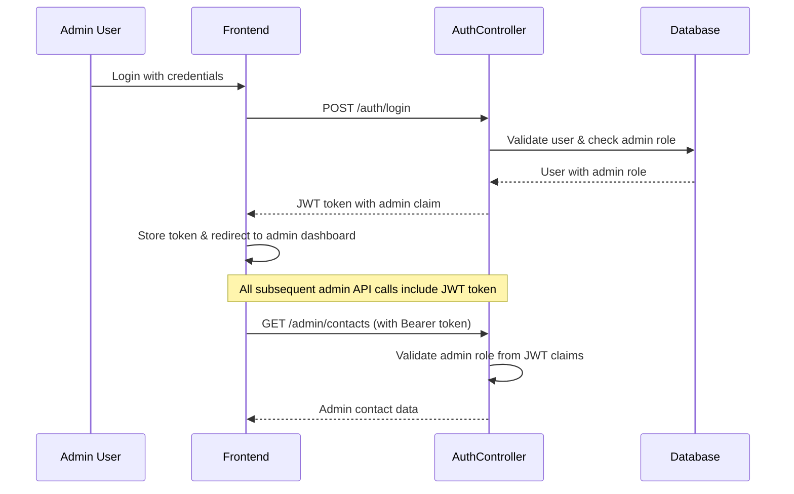

# Design Document

## Overview

The Admin Contact Management system extends the existing HireThemNow application to provide administrative capabilities for managing HR contacts and job opportunities collected through the webhook system. The design leverages the existing authentication infrastructure, database models, and React frontend architecture while adding new admin-specific components and API endpoints.

The system follows a three-tier architecture with a React frontend, ASP.NET Core Web API backend, and PostgreSQL database. Admin functionality is secured through role-based authentication using JWT tokens with admin role claims.

## Architecture

### System Components



### Authentication Flow



## Components and Interfaces

### Backend Components

#### 1. Admin Contact Controller
**File**: `HireThemNoW.Server/Controllers/AdminContactController.cs`

```csharp
[ApiController]
[Route("api/admin/[controller]")]
[Authorize(Roles = "admin")]
public class AdminContactController : ControllerBase
{
    // GET /api/admin/contacts - List all contacts with pagination and search
    [HttpGet]
    public async Task<ActionResult<ApiResponse<PagedResult<JobOpportunity>>>> GetContacts(
        int page = 1, int pageSize = 20, string? search = null, string? sortBy = null)
    
    // GET /api/admin/contacts/{id} - Get specific contact details
    [HttpGet("{id}")]
    public async Task<ActionResult<ApiResponse<JobOpportunity>>> GetContact(int id)
    
    // PUT /api/admin/contacts/{id} - Update contact information
    [HttpPut("{id}")]
    public async Task<ActionResult<ApiResponse<JobOpportunity>>> UpdateContact(int id, UpdateContactRequest request)
    
    // DELETE /api/admin/contacts/{id} - Delete contact
    [HttpDelete("{id}")]
    public async Task<ActionResult<ApiResponse<object>>> DeleteContact(int id)
}
```

#### 2. Admin Contact Service
**File**: `HireThemNoW.Server/Services/IAdminContactService.cs`

```csharp
public interface IAdminContactService
{
    Task<PagedResult<JobOpportunity>> GetContactsAsync(int page, int pageSize, string? search, string? sortBy);
    Task<JobOpportunity?> GetContactAsync(int id);
    Task<JobOpportunity> UpdateContactAsync(int id, UpdateContactRequest request);
    Task<bool> DeleteContactAsync(int id);
}
```

#### 3. Data Transfer Objects
**File**: `HireThemNoW.Server/Models/AdminContactDtos.cs`

```csharp
public class UpdateContactRequest
{
    public string JobTitle { get; set; } = string.Empty;
    public string Company { get; set; } = string.Empty;
    public string? Location { get; set; }
    public string? Emails { get; set; }
    public string? EmailType { get; set; }
    public bool IsRemote { get; set; }
    public string? Salary { get; set; }
    public string? Link { get; set; }
    public string? Snippet { get; set; }
}

public class PagedResult<T>
{
    public List<T> Items { get; set; } = new();
    public int TotalCount { get; set; }
    public int Page { get; set; }
    public int PageSize { get; set; }
    public int TotalPages => (int)Math.Ceiling((double)TotalCount / PageSize);
}
```

### Frontend Components

#### 1. Admin Dashboard Layout
**File**: `hirethemnow.client/src/pages/admin/AdminDashboard.tsx`

Main admin interface with navigation and contact management sections.

#### 2. Contact List Component
**File**: `hirethemnow.client/src/components/admin/ContactList.tsx`

- Displays paginated list of HR contacts
- Includes search and filter functionality
- Provides sorting options (date, company, job title)
- Shows key contact information in table format

#### 3. Contact Detail Modal
**File**: `hirethemnow.client/src/components/admin/ContactDetailModal.tsx`

- Shows complete contact information
- Provides edit and delete actions
- Displays formatted job description and metadata

#### 4. Contact Edit Form
**File**: `hirethemnow.client/src/components/admin/ContactEditForm.tsx`

- Form for editing contact information
- Includes validation for required fields
- Handles form submission and error states

#### 5. Admin Route Protection
**File**: `hirethemnow.client/src/components/admin/AdminRoute.tsx`

```typescript
const AdminRoute: React.FC<{ children: React.ReactNode }> = ({ children }) => {
  const { user, loading } = useAuth();

  if (loading) return <LoadingSpinner />;
  
  if (!user || user.role !== 'admin') {
    return <Navigate to="/401" />;
  }

  return <>{children}</>;
};
```

## Data Models

### User Model Enhancement
The existing `User` model will be enhanced to support admin role:

```csharp
public class User
{
    // ... existing properties
    public string Role { get; set; } = "candidate"; // "candidate", "employer", or "admin"
}
```

### Job Opportunity Model
The existing `JobOpportunity` model remains unchanged but will be accessed through admin-specific service methods:

```csharp
public class JobOpportunity
{
    public int Id { get; set; }
    public string JobTitle { get; set; } = string.Empty;
    public string Company { get; set; } = string.Empty;
    public string Location { get; set; } = string.Empty;
    public string Emails { get; set; } = string.Empty;
    public string EmailType { get; set; } = "summary";
    public bool IsRemote { get; set; } = false;
    public string Salary { get; set; } = string.Empty;
    public string Link { get; set; } = string.Empty;
    public string Snippet { get; set; } = string.Empty;
    public DateTime? ScrapedDate { get; set; }
    public DateTime CreatedAt { get; set; } = DateTime.UtcNow;
}
```

## Error Handling

### Backend Error Handling
- **401 Unauthorized**: Non-admin users attempting to access admin endpoints
- **404 Not Found**: Contact ID does not exist
- **400 Bad Request**: Invalid request data or validation failures
- **500 Internal Server Error**: Database or system errors

### Frontend Error Handling
- **Network Errors**: Display user-friendly error messages with retry options
- **Validation Errors**: Show field-specific error messages in forms
- **Authorization Errors**: Redirect to unauthorized page
- **Loading States**: Show spinners during API calls

## Testing Strategy

### Backend Testing
1. **Unit Tests** (Optional)
   - AdminContactService business logic validation
   - Contact data validation and transformation
   - Search and pagination logic

2. **Integration Tests** (Optional)
   - Admin API endpoints with authentication
   - Database operations for contact management
   - Role-based authorization testing

### Frontend Testing
1. **Component Tests** (Optional)
   - Contact list rendering and interaction
   - Form validation and submission
   - Modal behavior and state management

2. **End-to-End Tests** (Optional)
   - Complete admin workflow from login to contact management
   - Search and filter functionality
   - CRUD operations on contacts

## Security Considerations

### Authentication & Authorization
- JWT tokens must include admin role claims
- All admin endpoints require `[Authorize(Roles = "admin")]` attribute
- Frontend routes protected with admin role validation
- Automatic logout on token expiration

### Data Protection
- Input validation and sanitization for all contact data
- SQL injection prevention through Entity Framework
- XSS protection through proper data encoding
- CORS configuration to restrict API access

### Audit Logging
- Log all admin actions (view, edit, delete contacts)
- Include user ID, timestamp, and action details
- Store logs for compliance and security monitoring

## Performance Considerations

### Database Optimization
- Indexed columns for search functionality (company, job_title)
- Pagination to limit query results
- Efficient sorting with database-level ordering

### Frontend Optimization
- Lazy loading of contact details
- Debounced search input to reduce API calls
- Virtual scrolling for large contact lists
- Caching of frequently accessed data

### API Design
- RESTful endpoints with consistent response formats
- Proper HTTP status codes for different scenarios
- Compression for large response payloads
- Rate limiting to prevent abuse

## Deployment Considerations

### Database Changes
- No schema changes required (existing JobOpportunity table)
- Admin user creation through seeding or manual insertion
- Database migration for any new indexes

### Environment Configuration
- No new environment variables required
- Existing JWT and database configurations sufficient
- CORS settings may need admin domain inclusion

### Monitoring
- API endpoint monitoring for admin functions
- Error rate tracking for admin operations
- Performance metrics for contact queries
- User activity logging for admin actions