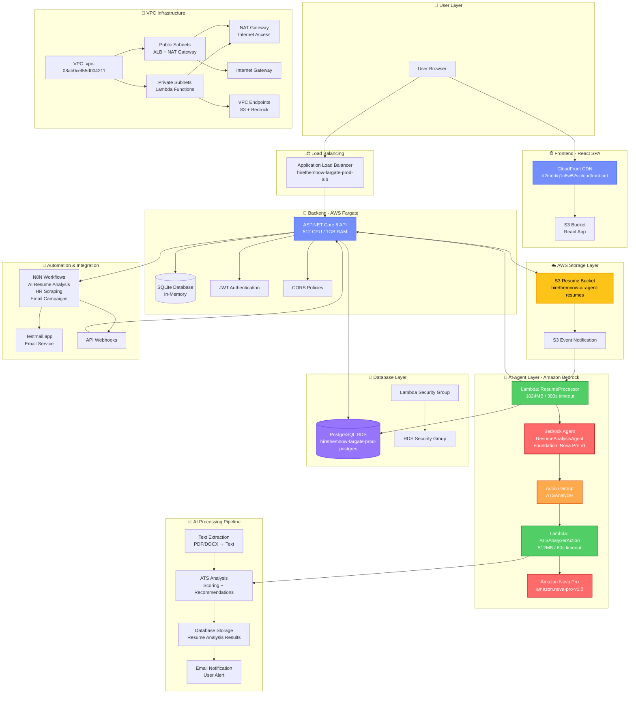
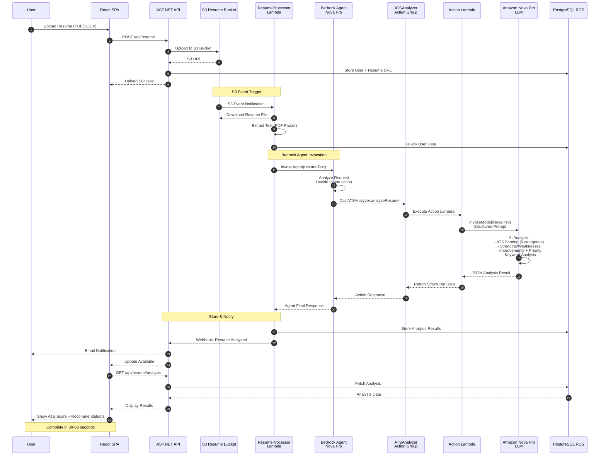
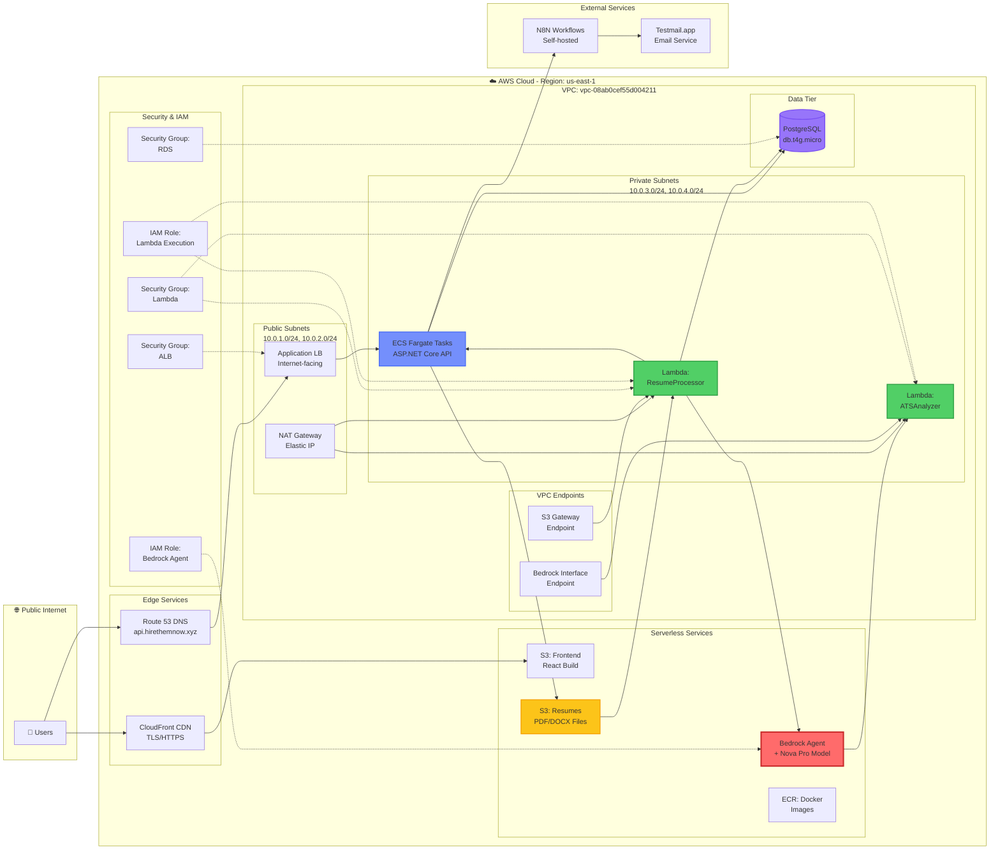
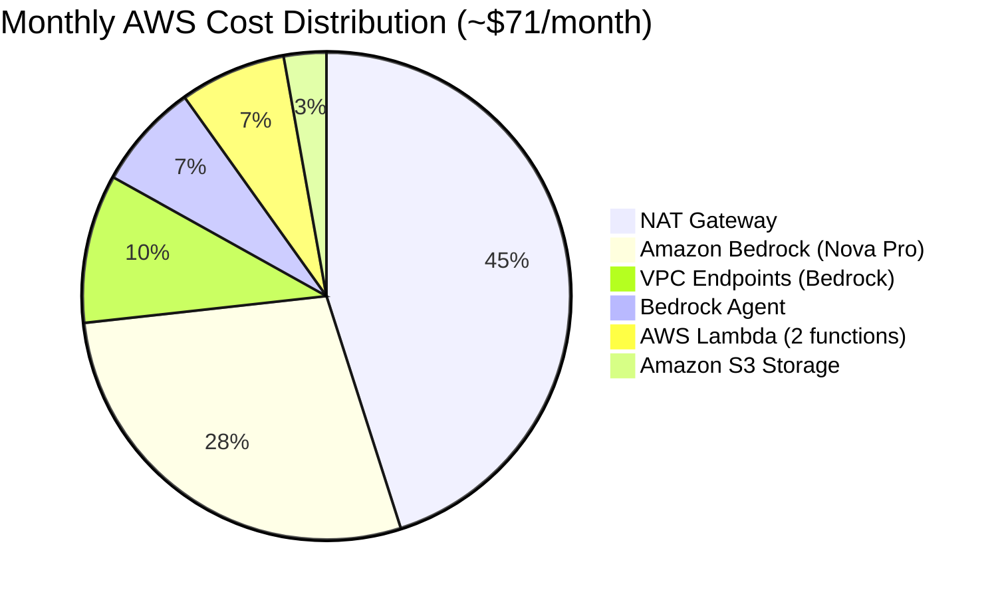
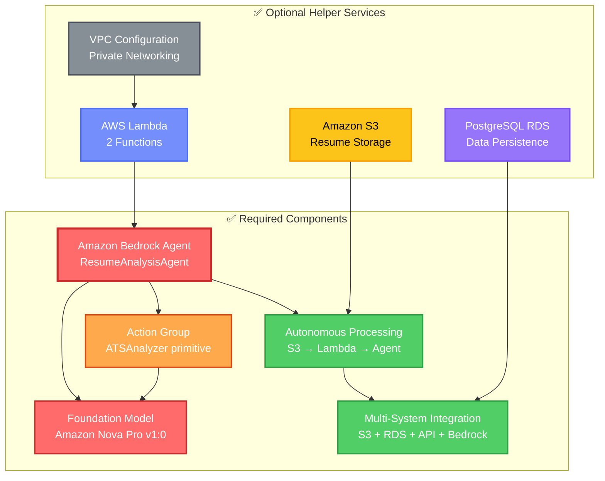

# HireThemNow 🚀

**AI-Powered Automated Job Hunting Platform** - Upload your resume, let AI analyze it, scrape HR contacts, and automatically send personalized cold emails to get you interviews.

> 🏆 **AWS AI Agent Competition Ready** - Fully compliant with all requirements including Amazon Bedrock Agent with action groups!

## 📊 Quick Navigation

- [🎨 Architecture Diagrams](#-complete-system-architecture) - Visual overview of entire system
- [🔄 Resume Analysis Flow](#-complete-resume-analysis-flow-bedrock-agent) - Step-by-step sequence diagram
- [🏢 Infrastructure Components](#-infrastructure-components-detail) - Detailed AWS setup
- [💰 Cost Breakdown](#-aws-services--cost-breakdown) - Monthly pricing (~$86/month)
- [🚀 Quick Start](#-quick-start) - Get running in 5 minutes
- [🤖 Bedrock Agent Details](#-aws-ai-agent-competition-compliance) - Competition compliance

## 🏗️ Complete System Architecture

### 🎨 High-Level Architecture Diagram

**Components:**
- 🌐 **Frontend**: React SPA hosted on CloudFront + S3
- 🐳 **Backend**: ASP.NET Core 8 API on AWS Fargate
- 🤖 **AI Agent**: Amazon Bedrock Agent with Nova Pro + action groups
- ⚡ **Serverless**: 2 AWS Lambda functions for resume processing
- 🗄️ **Database**: PostgreSQL RDS for data persistence
- 📦 **Storage**: S3 for resume files
- 🔌 **Networking**: VPC with public/private subnets, NAT Gateway, VPC endpoints



### 🔄 Complete Resume Analysis Flow (Bedrock Agent)



### 🏢 Infrastructure Components Detail



### 💰 AWS Services & Cost Breakdown



### 🎯 AWS Services Used

| Service | Purpose | Configuration | Cost/Month |
|---------|---------|---------------|------------|
| **🤖 Amazon Bedrock Agent** | AI orchestration with action groups | Nova Pro foundation model, 1 action group | ~$5 |
| **🧠 Amazon Nova Pro** | LLM for resume analysis | amazon.nova-pro-v1:0 via Bedrock Runtime | ~$20 (100 resumes) |
| **⚡ AWS Lambda** | Serverless compute | 2 functions (1024MB + 512MB) | ~$5 |
| **📦 Amazon S3** | File storage | Resume bucket + Frontend bucket | ~$2 |
| **🗄️ PostgreSQL RDS** | Database | db.t4g.micro (shared from main stack) | Included |
| **🐳 AWS Fargate** | Container hosting | 512 CPU, 1GB RAM (shared) | Included |
| **⚖️ Application LB** | Load balancing | Internet-facing ALB (shared) | Included |
| **🌐 CloudFront** | CDN | Frontend distribution (shared) | Included |
| **🔌 VPC Endpoints** | Private AWS service access | S3 Gateway (free) + Bedrock Interface | ~$7 |
| **🌉 NAT Gateway** | Lambda internet access | Single NAT in public subnet | ~$32 |
| **🔐 IAM Roles** | Security & permissions | Lambda + Agent + Fargate roles | Free |
| **📊 CloudWatch Logs** | Logging & monitoring | Lambda + Fargate logs | ~$1 |
| **📋 ECR** | Docker registry | API container images (shared) | Free (500MB) |
| **🎯 Route 53** | DNS hosting | api.hirethemnow.xyz (shared) | Included |
| | | **Total AI Agent Cost** | **~$71/month** |
| | | **Total Application Cost** | **~$86/month** |

### 🏆 AWS AI Agent Competition Compliance



### 🎯 Key Architecture Decisions

| Decision | Rationale | Impact |
|----------|-----------|--------|
| **Amazon Bedrock Agent** | Meets AWS competition "strongly recommended" requirement | ✅ Action group primitives for tool use |
| **Amazon Nova Pro** | Cost-effective reasoning LLM ($0.80/1M input tokens) | 🎯 High-quality ATS analysis |
| **VPC Private Subnets** | Security best practice for Lambda | 🔒 Lambda isolated from internet |
| **NAT Gateway** | Lambda needs internet for API webhooks | 💰 $32/month but required |
| **VPC Endpoints** | Avoid NAT for AWS service calls | 💸 Saves bandwidth costs |
| **Public/Private Separation** | ALB needs IGW, Lambda needs NAT | ⚡ Proper routing per tier |
| **PostgreSQL RDS** | Persistent, relational data storage | 📊 Shared with main application |
| **AWS Fargate** | Serverless containers, no EC2 management | 🐳 $15/month, always-on API |
| **2 Lambda Functions** | Separation of concerns (processor vs. action) | 🎯 Scalable, event-driven |
| **S3 Event Trigger** | Automatic resume processing | 🚀 Zero-touch automation |

### 📦 Deployment Automation

**GitHub Actions Workflow:**
```yaml
Trigger: Push to main branch
├── 1. Build React frontend → Deploy to S3
├── 2. Build .NET API → Push Docker to ECR → Update Fargate
├── 3. Package Lambda functions → Upload to S3
├── 4. Deploy CloudFormation stack:
│      ├── Create Bedrock Agent
│      ├── Create action group
│      ├── Create 2 Lambda functions
│      ├── Configure VPC networking
│      └── Set up IAM roles & permissions
└── 5. Update Lambda function code

Total Deployment Time: ~5-7 minutes
```

**Infrastructure as Code:**
- CloudFormation template: `aws-infrastructure/cloudformation-template.yaml`
- Auto-detects VPC configuration from main stack
- Idempotent deployments (safe to re-run)
- Automatic rollback on failure

**Local Development:**
```bash
# Backend only
cd HireThemNoW.Server && dotnet run

# Frontend + Backend
docker-compose up --build -d
```

---

## 🏗️ System Architecture (Legacy Diagrams)

### 🌐 Production Infrastructure Overview

```
                                     ┌─ 👤 Users ─┐
                                     │             │
                                     ▼             ▼
                              🌍 CloudFront CDN
                        (d2mddiq1c6w52v.cloudfront.net)
                                     │
                         ┌───────────┼───────────┐
                         ▼                       ▼
                   📁 S3 Frontend           ⚖️ Application
                     (React SPA)            Load Balancer
                         │                       │
                         │                       ▼
                         │                🐳 AWS Fargate
                         │              (ASP.NET Core 8 API)
                         │                       │
                         │              ┌────────┼────────┐
                         │              ▼        ▼        ▼
                         │        📄 S3 Resume  💾 SQLite  🔐 JWT Auth
                         │         Storage      Database   & CORS
                         │              │
                         │              ▼
                         │        🤖 N8N Automation Engine
                         │              │
                         └──────────────┼──────────────────
                                        │
                    ┌───────────────────┼───────────────────┐
                    ▼                   ▼                   ▼
           📊 Resume Analysis   🔍 HR Contact Scraping  📧 Email Campaigns
           (AI Skill Extraction) (Web Scraping)        (Testmail.app)
                    │                   │                   │
                    └───────────────────┼───────────────────┘
                                        ▼
                              📬 Smart Mailbox System
                            (AI Sentiment Analysis Badges)
```

### 🔄 Complete Application Flow

```
┌─────────────────────────────────────────────────────────────────────────────┐
│                           HireThemNow Processing Pipeline                   │
└─────────────────────────────────────────────────────────────────────────────┘

1️⃣ USER ONBOARDING
   👤 User Registration
   ├── 📝 Account Creation (Email/Password or Google OAuth)
   ├── 🔐 JWT Token Generation & Authentication
   └── 📄 Resume Upload → 📁 AWS S3 Storage (2MB max)

2️⃣ AI RESUME ANALYSIS
   🚀 Trigger: Resume uploaded
   ├── 📤 Generate S3 Pre-signed URL (1-hour expiry)
   ├── 🔔 Send Webhook → N8N Analysis Workflow
   ├── 🤖 AI Processing:
   │   ├── 📊 Extract Skills, Experience, Education
   │   ├── ✍️ Generate 5 Personalized Email Templates
   │   └── 🎯 Identify Target Industries & Roles
   └── 📥 Results sent back via Webhook → API Database

3️⃣ HR CONTACT DISCOVERY
   🔍 Automatic HR Scraping Workflow
   ├── 🏢 Match Companies by User's Skills/Industry
   ├── 🌐 Web Scraping for HR Contacts:
   │   ├── 👥 HR Managers & Recruiters
   │   ├── 📧 Email Addresses
   │   └── 🏷️ Company & Role Information
   └── 📋 Bulk Import Contacts → API Database

4️⃣ AUTOMATED EMAIL CAMPAIGNS
   📧 Smart Cold Email System
   ├── 🎯 Select Appropriate Email Template
   ├── 🔧 Personalize Content for Each Contact
   ├── 📬 Send via Testmail.app Integration
   ├── 📊 Track Email Delivery Status
   └── 🔄 Schedule Follow-up Campaigns

5️⃣ RESPONSE MONITORING & AI ANALYSIS
   📨 Real-time Email Response Processing
   ├── 🔍 Monitor Testmail.app for Replies
   ├── 🧠 AI Sentiment Analysis on Responses:
   │   ├── 🟢 Interview Invitations
   │   ├── 🔴 Rejection Notices
   │   ├── 🔵 Positive Interest
   │   └── ⚫ Negative/No Interest
   └── 🏷️ Apply Smart Badges to Mailbox

6️⃣ USER DASHBOARD & INSIGHTS
   📱 Real-time Progress Tracking
   ├── 📊 Campaign Analytics & Statistics
   ├── 📬 Smart Mailbox with AI-categorized responses
   ├── 🎯 Interview Opportunity Highlights
   └── 📈 Job Hunt Progress & Success Metrics
```

### 💻 Technology Stack Architecture

```
┌─────────────────┐    ┌─────────────────┐    ┌─────────────────┐
│   🎨 FRONTEND    │    │  🛠️ BACKEND      │    │ ☁️ INFRASTRUCTURE │
├─────────────────┤    ├─────────────────┤    ├─────────────────┤
│ React 19        │◄──►│ ASP.NET Core 8  │◄──►│ AWS Fargate     │
│ TypeScript      │    │ Entity Framework│    │ Application LB  │
│ Tailwind CSS    │    │ JWT Auth        │    │ CloudFront CDN  │
│ Vite Build      │    │ Swagger API     │    │ S3 Storage      │
│ React Router    │    │ SQLite Database │    │ ECR Registry    │
│ Lucide Icons    │    │ CORS Enabled    │    │ Route 53 DNS    │
└─────────────────┘    └─────────────────┘    └─────────────────┘
         │                        │                        │
         └────────────────────────┼────────────────────────┘
                                  │
        ┌─────────────────────────┼─────────────────────────┐
        │                        │                        │
┌─────────────────┐    ┌─────────────────┐    ┌─────────────────┐
│ 🤖 AUTOMATION   │    │ 📧 EMAIL SERVICE │    │ 🔐 SECURITY     │
├─────────────────┤    ├─────────────────┤    ├─────────────────┤
│ N8N Workflows   │    │ Testmail.app    │    │ JWT Tokens      │
│ AI Integration  │    │ SMTP Service    │    │ HTTPS/TLS       │
│ Web Scraping    │    │ Response Track  │    │ CORS Policies   │
│ Webhook APIs    │    │ Email Analytics │    │ OAuth Google    │
│ Cron Scheduling │    │ Template Engine │    │ Pre-signed URLs │
└─────────────────┘    └─────────────────┘    └─────────────────┘
```

### 🌊 Data Flow & Integration Patterns

**📄 Resume Processing Pipeline:**
```
Upload → S3 Secure Storage → Pre-signed URL → N8N Webhook → AI Analysis → JSON Response → Database Update
```

**📧 Email Campaign Lifecycle:**
```
Contact Discovery → Template Selection → AI Personalization → Testmail.app → Delivery Tracking → Response Analysis
```

**🔄 Real-time Dashboard Updates:**
```
N8N Event → API Webhook → In-Memory Update → Frontend Polling → Live UI Refresh
```

### 🚀 Deployment Environments

| Environment | Frontend URL | Backend API | Database | Automation |
|-------------|-------------|-------------|-----------|------------|
| **Development** | `http://localhost:5173` | `http://localhost:8080` | SQLite File | Local N8N |
| **Production** | `https://d2mddiq1c6w52v.cloudfront.net` | AWS Fargate ALB | In-Memory SQLite | Cloud N8N |
| **Cost** | Free (Dev) | ~$15/month (Prod) | Included | Variable |

## 🎯 What It Does

1. **Simple Onboarding**: Users upload resume + name only
2. **AI Resume Analysis**: Extracts skills, experience, education + generates 5 cold email templates
3. **HR Contact Scraping**: Finds relevant HR contacts grouped by industry/skills
4. **Automated Cold Emails**: Sends personalized emails via testmail.app
5. **Smart Mailbox**: Shows sent emails and replies with AI sentiment analysis badges (Interview/Rejection/Positive/Negative)

## 🚀 Quick Start

### Production Deployment (One Command)
```bash
# Deploy complete application
docker-compose up --build -d

# Access at: http://localhost:8080
```

### Development
```bash
# Backend (Terminal 1)
cd HireThemNoW.Server && dotnet run

# Frontend (Terminal 2)
cd hirethemnow.client && npm run dev
```

### Quick Deploy Script
```powershell
# One command: lint + type-check + build + commit + push
.\quick-deploy.ps1

# With custom message
.\quick-deploy.ps1 -Message "feat: add amazing feature"
```

## 🔧 Tech Stack

### Frontend
- **React 19** + **TypeScript** - UI framework with type safety
- **Vite** - Lightning fast build tool
- **Tailwind CSS** - Utility-first styling
- **React Router** - Client-side navigation
- **Lucide React** - Beautiful icons

### Backend
- **ASP.NET Core 8** - Web API framework
- **Entity Framework Core** - ORM with SQLite
- **JWT Authentication** - Secure token-based auth
- **Swagger/OpenAPI** - API documentation

### Automation
- **N8N** - Workflow automation platform
- **testmail.app** - Email sending/tracking service
- **AI Integration** - Resume analysis + email sentiment

### Infrastructure
- **Docker** - Containerized deployment
- **SQLite** - Embedded database (cost-effective)
- **AWS Fargate** - Serverless containers (production)
- **GitHub Actions** - CI/CD pipeline

## 📋 Available Commands

### Development
```bash
# Frontend
npm run dev          # Start dev server
npm run build        # Build for production
npm run lint         # ESLint code quality check
npm run type-check   # TypeScript validation

# Backend
dotnet run           # Start API server
dotnet build         # Build project
dotnet publish       # Publish for production

# Quick Deploy (All-in-one)
.\quick-deploy.ps1   # Lint + build + commit + push
```

### Docker Production
```bash
docker-compose up --build -d     # Deploy production
docker-compose ps               # Check status
docker-compose logs             # View logs
docker-compose down             # Stop services
```

## 🤖 N8N Workflow Integration

The application integrates with N8N for automation via webhooks:

### 1. Resume Analysis Workflow
- **Trigger**: User uploads resume
- **Process**: AI analyzes resume → extracts skills/experience → generates 5 cold email templates
- **Webhook**: `POST /api/resume/analysis/result`

### 2. HR Scraping Workflow
- **Trigger**: Resume analysis complete
- **Process**: Scrapes HR contacts from web → groups by industry/skills
- **Webhook**: `POST /api/hrcontacts/bulk`

### 3. Cold Email Campaign
- **Trigger**: HR contacts available
- **Process**: Sends personalized emails via testmail.app → tracks responses
- **Webhook**: `POST /api/coldemail/outreach/sent`

### 4. Email Analysis
- **Trigger**: Reply received
- **Process**: AI analyzes sentiment → detects interviews/rejections
- **Webhook**: `POST /api/mailbox/analysis/result`

### Configuration
Update N8N webhook URLs in your environment:
```bash
N8N_RESUME_ANALYSIS_WEBHOOK=https://your-n8n-instance.com/webhook/resume-analysis
N8N_HR_SCRAPING_WEBHOOK=https://your-n8n-instance.com/webhook/hr-scraping
N8N_COLD_EMAIL_WEBHOOK=https://your-n8n-instance.com/webhook/cold-email-campaign
TESTMAIL_API_KEY=your-testmail-api-key
```

## 🔒 Pre-Commit Quality Checks

Automated code quality enforcement using **Husky** + **lint-staged**:

### What Runs Before Every Commit:
- ✅ **ESLint** - Code quality + auto-fix
- ✅ **TypeScript** - Type checking
- ✅ **Prettier** - Code formatting
- ✅ **Only staged files** processed (fast!)

### Manual Commands:
```bash
cd hirethemnow.client

npm run lint         # Check code quality
npm run type-check   # Validate TypeScript
npm run pre-commit   # Run all checks manually
```

### Bypass (Emergency Only):
```bash
git commit --no-verify -m "Emergency commit"
```

## 🌟 Key Features

### User Experience
- **Simplified Onboarding**: Just upload resume + name
- **Automated Everything**: No manual job searching needed
- **Smart Mailbox**: AI-analyzed email responses with visual badges
- **Real-time Updates**: See campaign progress and responses

### AI-Powered Analysis
- **Resume Parsing**: Extracts skills, experience, education
- **Email Generation**: Creates 5 personalized cold email templates
- **Sentiment Analysis**: Detects interview invitations, rejections, positive/negative responses
- **Smart Categorization**: Groups contacts by industry and skills

### Email Management
- **Automated Sending**: Bulk personalized cold emails
- **Response Tracking**: Monitors replies via testmail.app
- **Status Badges**: Visual indicators for email types:
  - 🟢 **Interview** - Interview invitation detected
  - 🔴 **Rejection** - Rejection email detected
  - 🔵 **Positive** - Positive response detected
  - ⚫ **Negative** - Not interested/negative response

## 📊 User Flow

1. **Registration**: User creates account with email/password
2. **Resume Upload**: Upload PDF/DOC resume file
3. **AI Analysis**: N8N workflow analyzes resume and generates email templates
4. **HR Scraping**: System finds relevant HR contacts based on skills
5. **Campaign Launch**: Automated cold email campaign begins
6. **Response Tracking**: Monitor sent emails and replies in mailbox
7. **Interview Management**: AI flags interview opportunities

## 🔐 Environment Variables

Copy `.env.example` to `.env` and configure:

```bash
# Database
DATABASE_PASSWORD=your_secure_password

# Authentication
JWT_SECRET=your_secure_jwt_secret_min_32_chars

# Google OAuth
GOOGLE_CLIENT_ID=your_google_client_id
GOOGLE_CLIENT_SECRET=your_google_client_secret

# AWS S3 (for resume uploads)
AWS_ACCESS_KEY_ID=your_aws_access_key
AWS_SECRET_ACCESS_KEY=your_aws_secret_key
AWS_REGION=us-east-1

# N8N Integration (Optional)
N8N_RESUME_ANALYSIS_WEBHOOK=https://your-n8n-instance.com/webhook/resume-analysis
N8N_HR_SCRAPING_WEBHOOK=https://your-n8n-instance.com/webhook/hr-scraping
N8N_COLD_EMAIL_WEBHOOK=https://your-n8n-instance.com/webhook/cold-email-campaign

# Email Service (Optional)
TESTMAIL_API_KEY=your-testmail-api-key
```

**See [DEPLOYMENT.md](DEPLOYMENT.md) for detailed setup instructions.**

## 📁 Project Structure

```
HireThemNow/
├── hirethemnow.client/          # React frontend
│   ├── src/
│   │   ├── components/
│   │   │   ├── onboarding/      # Resume upload
│   │   │   └── mailbox/         # Email management
│   │   ├── pages/               # Route components
│   │   └── types/               # TypeScript definitions
│   ├── .husky/                  # Git hooks
│   └── package.json             # Frontend dependencies
├── HireThemNoW.Server/          # ASP.NET Core backend
│   ├── Controllers/             # API endpoints
│   ├── Models/                  # Data models
│   ├── Services/                # Business logic
│   └── Program.cs               # Application entry
├── docker-compose.yml           # Production deployment
├── Dockerfile                   # Container configuration
├── quick-deploy.ps1             # Automated deployment script
└── README.md                    # This file
```

## 🚨 Troubleshooting

### Common Issues

1. **Docker Build Failures**
   ```bash
   # Clear Docker cache
   docker system prune -f
   docker-compose build --no-cache
   ```

2. **TypeScript Errors**
   ```bash
   cd hirethemnow.client
   npm run type-check
   # Fix reported errors before committing
   ```

3. **API Connection Issues**
   - Ensure backend is running on port 8080
   - Check `VITE_API_BASE_URL` in frontend
   - Verify CORS configuration in backend

4. **Pre-commit Hook Failures**
   ```bash
   cd hirethemnow.client
   npm run lint:fix     # Auto-fix linting issues
   npm run type-check   # Check for type errors
   ```

### Debug Mode
```bash
# Enable detailed logging
VITE_ENABLE_DEBUG=true
VITE_LOG_LEVEL=debug
```

## 🌍 Deployment Options

### Local Development
- **Quick Start**: `docker-compose up`
- **Separate Services**: Run frontend/backend individually
- **Hot Reload**: Changes reflected immediately

### Production
- **AWS Fargate**: Containerized, auto-scaling, cost-effective (~$15/month)
- **GitHub Actions**: Automated CI/CD pipeline
- **CloudFormation**: Infrastructure as Code

## 🤝 Contributing

1. **Fork** the repository
2. **Create** feature branch: `git checkout -b feature/amazing-feature`
3. **Make** your changes
4. **Test** locally: `docker-compose up`
5. **Deploy**: `.\quick-deploy.ps1` (auto-lints, builds, commits, pushes)
6. **Submit** pull request

### Development Workflow
- Pre-commit hooks ensure code quality
- GitHub Actions run full CI pipeline
- All commits must pass lint + type-check
- Semantic commit messages encouraged

## 📄 License

MIT License - Build amazing things! 🎉

---

## 🎯 Getting Started Checklist

- [ ] Clone repository
- [ ] Run `docker-compose up`
- [ ] Access http://localhost:8080
- [ ] Upload test resume
- [ ] Configure N8N workflows (optional)
- [ ] Set up testmail.app integration
- [ ] Deploy to production with GitHub Actions

**Ready to revolutionize job hunting? Let's build the future! 🚀**