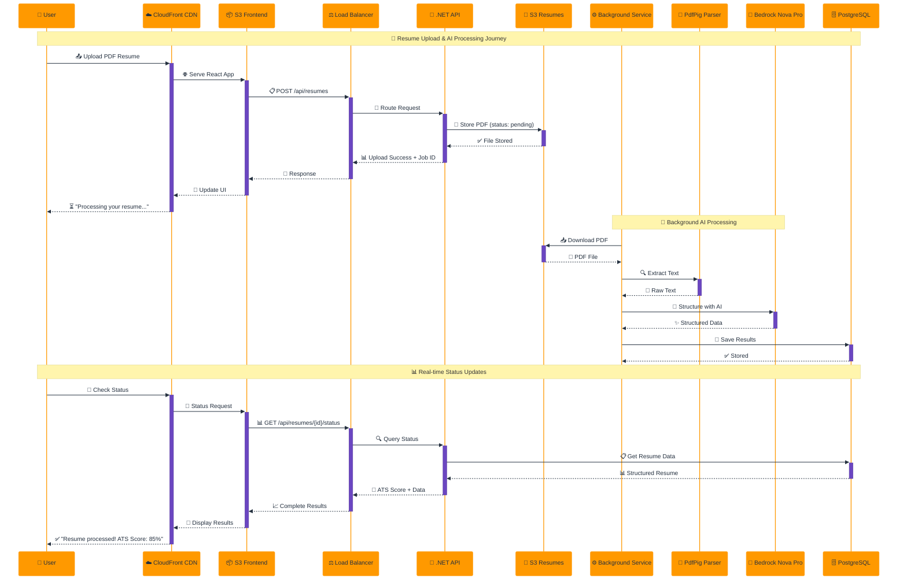
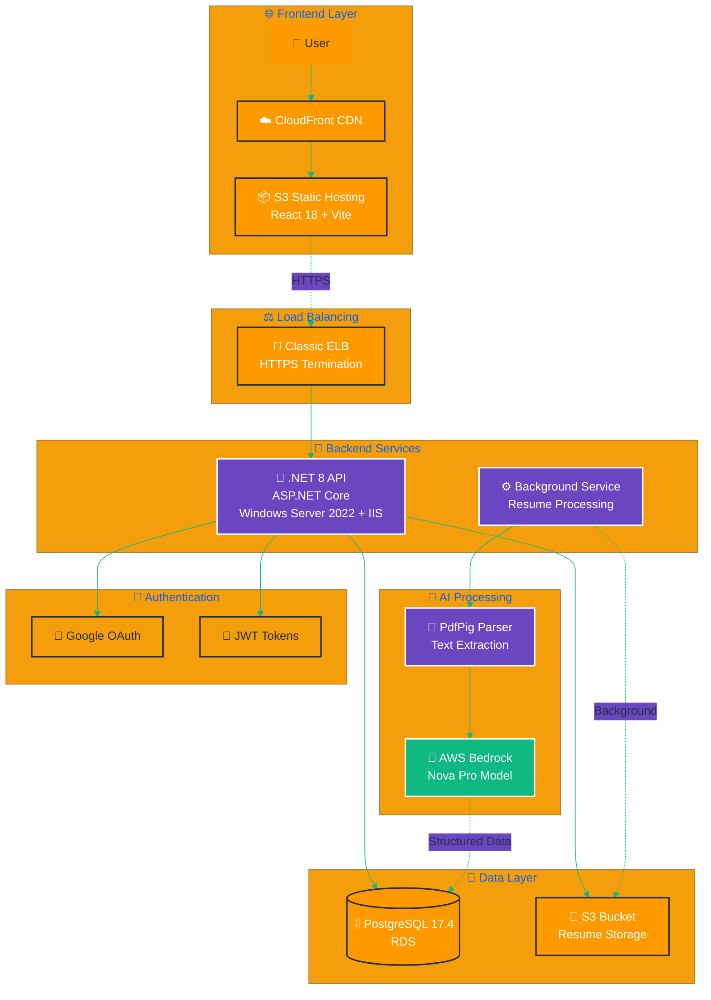

# HireThemNoW - Complete Deployment Guide

A modern job application tracking and resume analysis platform with AI-powered resume analysis.

**Live Demo:** https://hirethemnow.xyz
**API:** https://api.hirethemnow.xyz

---

## 🎬 How It Works

Watch the magic happen behind the scenes as your resume gets processed by our AI-powered platform:



### 🏗️ System Architecture Overview



### 🔄 Resume Processing Pipeline

```mermaid
%%{init: {'theme':'base', 'themeVariables': { 'primaryColor': '#ff9900', 'primaryTextColor': '#232f3e', 'primaryBorderColor': '#ff9900', 'lineColor': '#10b981', 'secondaryColor': '#6b46c1', 'tertiaryColor': '#f59e0b'}}}%%
flowchart LR
    A[📤 PDF Upload<br/>Max 5MB] --> B{📋 Validation}
    B -->|✅ Valid| C[💾 S3 Storage<br/>Status: Pending]
    B -->|❌ Invalid| X[🚫 Error Response]
    
    C --> D[⚙️ Background Queue<br/>Processing Starts]
    D --> E[📥 Download from S3]
    E --> F[📖 PdfPig Extraction<br/>Raw Text]
    F --> G[🤖 Bedrock Nova Pro<br/>AI Structuring]
    G --> H[📊 Generate ATS Score]
    H --> I[💾 Save to PostgreSQL<br/>Status: Complete]
    I --> J[🎉 Ready for User<br/>~30 seconds total]

    classDef process fill:#6b46c1,stroke:#fff,stroke-width:2px,color:#fff
    classDef storage fill:#ff9900,stroke:#232f3e,stroke-width:2px,color:#fff
    classDef ai fill:#10b981,stroke:#fff,stroke-width:2px,color:#fff
    classDef error fill:#ef4444,stroke:#fff,stroke-width:2px,color:#fff

    class A,D,F,H process
    class C,E,I storage
    class G ai
    class X error
```



### The Journey
1. **📤 Upload** - Drag & drop your PDF resume (max 5MB)
2. **🤖 Process** - AI extracts and structures your data using AWS Bedrock Nova Pro
3. **📊 Analyze** - Get ATS scores and professional insights
4. **📈 Track** - Monitor your job applications and progress

*⚡ Processing time: ~30 seconds for most resumes*

---

## 📋 Table of Contents

1. [Quick Start](#-quick-start)
2. [Prerequisites](#-prerequisites)
3. [Local Development](#-local-development)
4. [AWS Deployment](#-aws-deployment)
5. [Custom Domain Setup](#-custom-domain-setup)
6. [Troubleshooting](#-troubleshooting)
7. [Cost Estimates](#-monthly-cost-estimates)

---

## 🚀 Quick Start

### Deploy to AWS (Automated)

**⚠️ IMPORTANT: Create `.env.deploy` before deploying!**

```powershell
# Step 1: Copy the example file
cp .env.example .env.deploy

# Step 2: Edit .env.deploy with your actual credentials
# Required: AWS keys, JWT secret, Google OAuth, database password

# Step 3: Deploy backend
.\deploy-backend.ps1
# Answer prompts for database and HTTPS configuration

# Step 4: Deploy frontend
.\deploy-frontend.ps1
```

**🔒 Security:** `.env.deploy` is gitignored - never commit it!

---

## 📦 Prerequisites

### Required Tools

- **.NET 8 SDK** - [Download](https://dotnet.microsoft.com/download/dotnet/8.0)
- **Node.js 18+** - [Download](https://nodejs.org/)
- **AWS CLI** - [Download](https://aws.amazon.com/cli/)
- **PowerShell** - For deployment scripts

### AWS Setup

1. Create AWS account
2. Create IAM user with permissions: EC2, S3, ElasticBeanstalk, RDS, ACM, CloudFront, Bedrock
3. Configure AWS CLI:
```powershell
aws configure
# Enter Access Key, Secret Key, region (us-east-1)
```

**Note:** Bedrock access is required for AI-powered resume parsing using Amazon Nova Pro.

---

## 📄 Resume Parsing

### Supported Formats
- **PDF only** - Currently, only PDF files are supported for resume uploads
- **File size limit:** 5MB maximum
- **Processing:** Background processing with status tracking (pending → processing → completed/failed)

### Technology Stack
- **Text Extraction:** PdfPig library (open-source .NET PDF parser)
- **AI Structuring:** AWS Bedrock with Amazon Nova Pro model
- **Storage:** AWS S3 for resume files

### Configuration
Resume parsing is configured in `appsettings.json`:

```json
{
  "ResumeParsing": {
    "BedrockModelId": "amazon.nova-pro-v1:0",
    "MaxFileSizeBytes": 5242880,
    "ParsingTimeoutSeconds": 30,
    "SupportedFormats": ["pdf"],
    "EnableBackgroundProcessing": true,
    "PollingIntervalSeconds": 10,
    "MaxConcurrentProcessing": 3
  }
}
```

### How It Works
1. User uploads PDF resume via API
2. File stored in S3 with status "pending"
3. Background service downloads PDF from S3
4. PdfPig extracts text from PDF
5. Text sent to Bedrock Nova Pro for structuring
6. Structured data stored in database with status "completed"

### Error Handling
The system provides user-friendly error messages for common issues:
- **Corrupted/encrypted PDFs:** "The PDF file appears to be corrupted or password-protected"
- **File too large:** "The file is too large. Please upload a PDF file smaller than 5MB"
- **Service unavailable:** "Resume parsing service is temporarily unavailable"
- **Unsupported format:** "Only PDF files are currently supported"

### Required AWS Permissions
- `bedrock:InvokeModel` - For Amazon Nova Pro
- `s3:GetObject` - For downloading resumes from S3
- `s3:PutObject` - For uploading resumes to S3

**Note:** Textract is no longer required or used.

---

## 💻 Local Development

### Backend
```bash
cd HireThemNoW.Server
dotnet restore
dotnet run  # Runs at http://localhost:5219
```

### Frontend
```bash
cd hirethemnow.client
npm install
npm run dev  # Runs at http://localhost:5173
```

---

## 🚀 AWS Deployment

### Automated Deployment Scripts

#### `deploy-backend.ps1`
✅ .NET 8 build & IIS packaging
✅ Elastic Beanstalk deployment
✅ **Auto-detects database** (uses `postgres` if no initial DB)
✅ **Auto-configures security groups** (EB → RDS)
✅ **Interactive HTTPS setup** with SSL validation

```powershell
.\deploy-backend.ps1
```

**Prompts:**
1. "Have you created the RDS database?" (Y/N)
   - Detects database name automatically
   - Configures security groups
2. "Configure HTTPS with SSL certificate?" (Y/N)
   - Lists available certificates
   - Validates certificate covers `api.hirethemnow.xyz`
   - Configures load balancer

**Time:** First deploy ~10min, updates ~3min

**URLs:**
- Direct: `http://hirethemnow-prod.eba-km2y4gpp.us-east-1.elasticbeanstalk.com`
- Custom: `https://api.hirethemnow.xyz`

#### `deploy-frontend.ps1`
✅ React/Vite production build
✅ S3 bucket & static hosting
✅ CloudFront CDN
✅ **Auto cache invalidation**

```powershell
.\deploy-frontend.ps1
```

**Time:** ~3min

**URLs:**
- S3: `http://hirethemnow-frontend.s3-website-us-east-1.amazonaws.com`
- Custom: `https://hirethemnow.xyz`

---

### Database Setup

**Option 1: Let deployment script handle it** (Recommended)
- Script detects if RDS exists
- Uses `postgres` database if no initial DB
- Configures security groups automatically

**Option 2: Manual RDS creation**
```powershell
aws rds create-db-instance `
    --db-instance-identifier hirethemnow-db `
    --db-instance-class db.t3.micro `
    --engine postgres `
    --engine-version 17.4 `
    --master-username postgres `
    --master-user-password YOUR_PASSWORD `
    --allocated-storage 20 `
    --region us-east-1
```

**Key Point:** PostgreSQL 17.4 works perfectly with Npgsql 9.0.4 (included in project)

---

### SSL Certificate

**Automated via deployment script:**
1. Script lists existing certificates
2. Validates certificate covers `api.hirethemnow.xyz`
3. Configures HTTPS listener

**Manual request:**
```powershell
aws acm request-certificate `
  --domain-name hirethemnow.xyz `
  --subject-alternative-names "*.hirethemnow.xyz" "api.hirethemnow.xyz" "www.hirethemnow.xyz" `
  --validation-method DNS `
  --region us-east-1
```

Add DNS CNAME records from ACM console to validate (5-30min).

---

## 🌐 Custom Domain Setup

### DNS Records (at your domain registrar)

| Type | Name | Value |
|------|------|-------|
| CNAME | `api` | `awseb-e-x-awsebloa-x91qpl92x8fi-1030568985.us-east-1.elb.amazonaws.com` |
| CNAME | `www` | `<cloudfront-distribution>.cloudfront.net` |
| CNAME | `_validation` | (from ACM certificate) |

**Example for GoDaddy:**
```
Type: CNAME
Name: api
Value: awseb-e-x-awsebloa-x91qpl92x8fi-1030568985.us-east-1.elb.amazonaws.com
TTL: 3600
```

### Verify DNS
```powershell
nslookup api.hirethemnow.xyz
nslookup www.hirethemnow.xyz
```

---

## 🔧 Troubleshooting

**⚠️ Note:** Deployment scripts (`deploy-backend.ps1`, `deploy-frontend.ps1`) automatically handle most issues. This guide is for **manual fixes** when automation fails.

---

### Health Checks

```powershell
# Check backend status
curl https://api.hirethemnow.xyz/api/health

# Check Elastic Beanstalk environment
aws elasticbeanstalk describe-environments --environment-names hirethemnow-prod --region us-east-1

# View recent errors
aws elasticbeanstalk describe-events --environment-name hirethemnow-prod --region us-east-1 --max-items 20

# Check frontend
curl https://hirethemnow.xyz
```

---

### Common Error Messages

| Error | Cause | Fix |
|-------|-------|-----|
| "Network timeout" | Wrong DATABASE_NAME | Use `postgres` if no initial DB |
| "SEC_E_WRONG_PRINCIPAL" | Cert doesn't cover API subdomain | Request cert with `*.hirethemnow.xyz` |
| "Could not find file" | Missing deployment manifest | Run `deploy-backend.ps1` |
| "Command hooks failed" | `.ebextensions` exists | Remove `.ebextensions` folder |
| 404 errors | App needs restart | Run restart command below |

---

### Database Issues

#### Manual Database Configuration

If deployment script didn't configure database:

```powershell
# Get RDS endpoint
$DB_ENDPOINT = aws rds describe-db-instances --db-instance-identifier hirethemnow-db --region us-east-1 --query "DBInstances[0].Endpoint.Address" --output text

# Check if DB has initial database name
$DB_NAME = aws rds describe-db-instances --db-instance-identifier hirethemnow-db --region us-east-1 --query "DBInstances[0].DBName" --output text

# If output is "None", use "postgres"
if ($DB_NAME -eq "None") { $DB_NAME = "postgres" }

# Update environment
aws elasticbeanstalk update-environment `
  --environment-name hirethemnow-prod `
  --region us-east-1 `
  --option-settings `
    Namespace=aws:elasticbeanstalk:application:environment,OptionName=DATABASE_HOST,Value=$DB_ENDPOINT `
    Namespace=aws:elasticbeanstalk:application:environment,OptionName=DATABASE_NAME,Value=$DB_NAME `
    Namespace=aws:elasticbeanstalk:application:environment,OptionName=DATABASE_USER,Value=postgres `
    Namespace=aws:elasticbeanstalk:application:environment,OptionName=DATABASE_PASSWORD,Value=YOUR_PASSWORD
```

#### Manual Security Group Configuration

If RDS can't connect to Elastic Beanstalk:

```powershell
# Get security groups
$RDS_SG = aws rds describe-db-instances --db-instance-identifier hirethemnow-db --region us-east-1 --query "DBInstances[0].VpcSecurityGroups[0].VpcSecurityGroupId" --output text

$EB_SG = aws ec2 describe-security-groups --region us-east-1 --filters "Name=group-name,Values=awseb-e-*" --query "SecurityGroups[0].GroupId" --output text

# Add ingress rule
aws ec2 authorize-security-group-ingress --group-id $RDS_SG --protocol tcp --port 5432 --source-group $EB_SG --region us-east-1
```

---

### HTTPS/SSL Issues

#### Manual HTTPS Configuration

If deployment script didn't configure HTTPS:

```powershell
# List certificates
aws acm list-certificates --region us-east-1

# Check certificate domains
aws acm describe-certificate --certificate-arn YOUR_CERT_ARN --region us-east-1 --query "Certificate.SubjectAlternativeNames"

# Must include: api.hirethemnow.xyz or *.hirethemnow.xyz

# Configure HTTPS listener
aws elasticbeanstalk update-environment `
  --environment-name hirethemnow-prod `
  --region us-east-1 `
  --option-settings `
    Namespace=aws:elb:listener:443,OptionName=ListenerProtocol,Value=HTTPS `
    Namespace=aws:elb:listener:443,OptionName=InstancePort,Value=80 `
    Namespace=aws:elb:listener:443,OptionName=InstanceProtocol,Value=HTTP `
    Namespace=aws:elb:listener:443,OptionName=SSLCertificateId,Value=YOUR_CERT_ARN
```

#### Request New Certificate

If certificate doesn't cover API subdomain:

```powershell
aws acm request-certificate `
  --domain-name hirethemnow.xyz `
  --subject-alternative-names "*.hirethemnow.xyz" "api.hirethemnow.xyz" "www.hirethemnow.xyz" `
  --validation-method DNS `
  --region us-east-1
```

Add DNS CNAME records from output to validate (5-30 minutes).

---

### Deployment Failures

#### 404 Errors or App Not Responding

```powershell
# Restart application
aws elasticbeanstalk restart-app-server --environment-name hirethemnow-prod --region us-east-1
```

#### View Detailed Logs

```powershell
# Request logs
aws elasticbeanstalk request-environment-info --environment-name hirethemnow-prod --info-type tail --region us-east-1

# Wait 10 seconds, then retrieve
Start-Sleep -Seconds 10
aws elasticbeanstalk retrieve-environment-info --environment-name hirethemnow-prod --info-type tail --region us-east-1
```

---

### DNS Issues

#### Verify DNS Configuration

```powershell
nslookup api.hirethemnow.xyz
nslookup www.hirethemnow.xyz
```

**Required CNAME records at your domain registrar:**
- `api` → `awseb-e-x-awsebloa-x91qpl92x8fi-1030568985.us-east-1.elb.amazonaws.com`
- `www` → `your-cloudfront-distribution.cloudfront.net`

**DNS propagation:** May take 5 minutes to 48 hours depending on TTL

---

### Need More Help?

1. **Check deployment script output** - Shows exactly what it's doing
2. **View CloudWatch Logs** - AWS Console → CloudWatch → Log Groups → `/aws/elasticbeanstalk/hirethemnow-prod`
3. **Check Elastic Beanstalk Events** - AWS Console → Elastic Beanstalk → Environments → Events tab

**💡 Tip:** Re-run `deploy-backend.ps1` - it's idempotent and will fix most issues automatically

---

## 💰 Monthly Cost Estimates

### Free Tier (First 12 months)
- EC2: 750 hours/month t3.micro
- RDS: 750 hours/month db.t3.micro
- S3: 5GB storage
- CloudFront: 50GB transfer

### Development (~$25/month)
- Elastic Beanstalk (t3.micro): ~$8
- RDS (db.t3.micro): ~$15
- S3 + CloudFront: ~$2

### Production (~$62/month)
- Elastic Beanstalk (t3.small): ~$17
- RDS (db.t3.small): ~$30
- S3 + CloudFront: ~$15

---

## 🔐 Environment Variables

### .env.deploy (Required)
```env
AWS_ACCESS_KEY_ID=your_key
AWS_SECRET_ACCESS_KEY=your_secret
AWS_REGION=us-east-1
JWT_SECRET=your_random_32char_string
GOOGLE_CLIENT_ID=your_google_id
GOOGLE_CLIENT_SECRET=your_google_secret
DATABASE_PASSWORD=your_secure_password
AWS__S3__BucketName=hirethemnow-resumes
```

### Auto-Configured
Deployment scripts automatically set:
- `DATABASE_HOST` - RDS endpoint
- `DATABASE_NAME` - `postgres` (auto-detected)
- `DATABASE_USER` - `postgres`

---

## 📚 Architecture

### Backend
- **Platform:** Windows Server 2022 + IIS 10.0
- **Runtime:** .NET 8 + ASP.NET Core
- **Database:** PostgreSQL 17.4 (RDS)
- **Storage:** AWS S3 (resumes)
- **Auth:** JWT + Google OAuth
- **AI/ML:** AWS Bedrock (Amazon Nova Pro for resume structuring)
- **PDF Processing:** PdfPig library for text extraction

### Frontend
- **Framework:** React 18 + Vite
- **Hosting:** S3 + CloudFront
- **SSL:** AWS Certificate Manager

### Infrastructure
- **Load Balancer:** Classic ELB (HTTPS on port 443)
- **CDN:** CloudFront
- **DNS:** Custom domain with CNAME records

---

## ✨ Features

- 📝 Resume upload & parsing (PDF only, max 5MB)
- 🤖 AI-powered resume analysis (AWS Bedrock Nova Pro)
- 🎯 ATS score calculation
- 📊 Application tracking
- 🔐 Google OAuth authentication
- 💼 Job posting management
- 📧 Email notifications
- ☁️ Cloud storage (S3)

---

## 🆘 Support

**Deployment Issues:**
1. Check [Troubleshooting](#-troubleshooting) section above
2. View logs: `aws elasticbeanstalk describe-events --environment-name hirethemnow-prod --region us-east-1`
3. Check CloudWatch Logs in AWS Console

---

## 📄 License

MIT License - See LICENSE file

---

**Built with:** ASP.NET Core 8 • React 18 • PostgreSQL 17 • AWS
